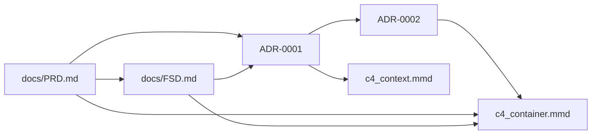

# FTGO — Laboratorio de Arquitectura de Software

| Campo | Valor |
|-------|-------|
| **Caso** | FTGO (Food To Go) — marketplace de delivery |
| **Enfoque** | Migración monolito → microservicios (Strangler Fig, 18–24 meses) |
| **Referencias** | *Microservices Patterns* (Chris Richardson), C4 Model (Simon Brown) |
| **Estado del repo** | Artefactos de diseño completos (PRD, FSD, ADR, C4, prompts v2.0) |

---

## 1. Descripción del laboratorio

Este repositorio documenta la **arquitectura objetivo** de FTGO durante su transición desde un **monolito Java WAR** hacia una plataforma basada en **capacidades de negocio** desplegadas como microservicios.

**Problemas del estado actual (brief):** builds lentos, acoplamiento fuerte, escalabilidad limitada, lock-in tecnológico y baja tolerancia a fallos de proveedores externos (p. ej. Stripe).

**Objetivos del laboratorio:**

- Definir requisitos trazables (PRD) y comportamiento funcional (FSD).
- Registrar decisiones arquitectónicas (ADR) con trade-offs reales.
- Modelar la plataforma en **C4 Nivel 1 (Contexto)** y **Nivel 2 (Contenedores)**.
- Demostrar **ingeniería de prompts** mediante versiones mejoradas con métricas reproducibles.

**Restricciones del caso:** seis stakeholders oficiales, siete capacidades de negocio, NFRs del brief (latencia p95, pico 5×, Strangler, resiliencia de pagos, etc.). No se inventa dominio adicional (loyalty, groceries, multi-región activo-activo).

---

## 2. Estructura del repositorio

```
examen-arquitectura-ftgo/
├── README.md                          # Este archivo
├── docs/
│   ├── PRD.md                         # Product Requirements Document v1.1
│   ├── FSD.md                         # Functional Specification v1.1
│   ├── adr/
│   │   ├── 0001-descomposicion-microservicios.md   # ADR-0001 v1.1 [Accepted]
│   │   └── 0002-ipc-event-driven.md                # ADR-0002 v1.1 [Accepted]
│   └── diagrams/
│       ├── c4_context.mmd             # C4 Context [v1.1]
│       └── c4_container.mmd           # C4 Container [v1.1]
└── prompts_mejorados/
    ├── prd_mejorado.md                 # Prompt PRD v2.0
    ├── fsd_mejorado.md                 # Prompt FSD v2.0
    ├── adr_mejorado.md                 # Prompt ADR v2.0
    └── _legacy/                        # Semillas v0.1 (no usar en entrega)
        ├── README.md
        ├── 01-generar-prd.md
        └── 02-generar-fsd.md
```

---

## 3. Artefactos generados

| Artefacto | Ruta | Versión | Contenido principal |
|-----------|------|---------|---------------------|
| **PRD** | `docs/PRD.md` | 1.1 | Contexto, 6 STK, 7 capacidades C-01…C-07, NFR-01…10, alcance In/Out, fases F0–F3 |
| **FSD** | `docs/FSD.md` | 1.1 | 5 UCs (pedido, ticket, courier, pago, tracking), GWT, trazabilidad US/PRD |
| **ADR-0001** | `docs/adr/0001-descomposicion-microservicios.md` | 1.1 | Híbrido incremental + Strangler; 3 opciones; fases extracción |
| **ADR-0002** | `docs/adr/0002-ipc-event-driven.md` | 1.1 | Híbrido REST + Kafka; topics; reglas C4 |
| **C4 Context** | `docs/diagrams/c4_context.mmd` | 1.1 | Actores, FTGO Platform, externos + Monolito Legacy |
| **C4 Container** | `docs/diagrams/c4_container.mmd` | 1.1 | 7 servicios + Gateway + Kafka + DB-per-service + apps |
| **Prompt PRD** | `prompts_mejorados/prd_mejorado.md` | 2.0 | Anti-patterns, verificación, métricas, 3 corridas |
| **Prompt FSD** | `prompts_mejorados/fsd_mejorado.md` | 2.0 | 5 UCs, GWT, granularidad, métricas, 3 corridas |
| **Prompt ADR** | `prompts_mejorados/adr_mejorado.md` | 2.0 | Trade-offs, 8 dimensiones, validaciones, 3 corridas |

---

## 4. Comandos para prompts y validación

Ejecutar desde la raíz del repositorio.

### 4.1 Generación con agente IA (Cursor / CLI)

1. `prompts_mejorados/prd_mejorado.md` → **PROMPT EJECUTABLE** → `docs/PRD.md`.
2. `prompts_mejorados/fsd_mejorado.md` → **PROMPT EJECUTABLE** → `docs/FSD.md` (requiere PRD).
3. `prompts_mejorados/adr_mejorado.md` → `ADR-0001` luego `ADR-0002` (requiere PRD + FSD).

**Ejemplos de invocación:**

```text
Usa prompts_mejorados/fsd_mejorado.md. Genera docs/FSD.md. Upstream: docs/PRD.md v1.1.
```

```text
Usa prompts_mejorados/adr_mejorado.md. Genera ADR-0002. Status: Accepted.
Upstream: docs/PRD.md, docs/FSD.md, ADR-0001 Accepted.
```

### 4.2 Validación PRD (PowerShell)

```powershell
Select-String -Path docs/PRD.md -Pattern "## 1\. Contexto","## 2\. Stakeholders","## 3\. Capacidades","## 4\. Requisitos","## 5\. Alcance"
(Select-String -Path docs/PRD.md -Pattern "### NFR-").Count          # >= 5
Select-String -Path docs/PRD.md -Pattern "Regulador|Inversor|Loyalty|Groceries"  # sin coincidencias
```

### 4.3 Validación FSD (PowerShell)

```powershell
(Select-String -Path docs/FSD.md -Pattern "^## UC-").Count            # >= 5
(Select-String -Path docs/FSD.md -Pattern "^\*\*Given:\*\*").Count    # >= 5
Select-String -Path docs/FSD.md -Pattern "Loyalty|Groceries|UC-06:"  # sin coincidencias
```

Ver `prompts_mejorados/fsd_mejorado.md` (sección **Comandos README**).

### 4.4 Validación ADRs (PowerShell)

```powershell
(Select-String -Path docs/adr/0001-descomposicion-microservicios.md -Pattern "### Opción").Count   # >= 3
Select-String -Path docs/adr/0001-descomposicion-microservicios.md -Pattern "Negativas"
Select-String -Path docs/adr/0002-ipc-event-driven.md -Pattern "Kafka|ContainerQueue"
(Select-String -Path docs/adr/*.md -Pattern "\[PRD NFR-").Count     # >= 8
```

### 4.5 Validación diagramas C4 (Mermaid CLI)

```bash
npx -y @mermaid-js/mermaid-cli@11.4.0 -i docs/diagrams/c4_context.mmd -o docs/diagrams/c4_context.png
npx -y @mermaid-js/mermaid-cli@11.4.0 -i docs/diagrams/c4_container.mmd -o docs/diagrams/c4_container.png
```

Salida esperada: exit code `0` en ambos comandos (sintaxis C4 válida).

### 4.6 Validación rápida (bash)

```bash
grep -E "^## [1-5]\." docs/PRD.md
grep -c "### NFR-" docs/PRD.md
grep -c "### Opción" docs/adr/0001-descomposicion-microservicios.md
grep -iE "Kafka|ContainerQueue" docs/adr/0002-ipc-event-driven.md
```

---

## 5. Métricas de prompts mejorados

Resumen consolidado (promedio **3 corridas comparativas** por prompt; evaluación manual contra rúbrica).

### Prompt PRD (`prd_mejorado.md` v2.0)

| Métrica | v0.1 semilla | v2.0 | Δ |
|---------|--------------|------|---|
| Cobertura secciones PRD (5/5) | 20% | 100% | +80 pp |
| NFRs formato completo (≥5) | 0/5 | 10/10 | +100% |
| Referencias trazables | 0–1 | ≥15 | — |
| Dominio inventado | Alto | 0 | −100% |
| Iteraciones hasta aceptable | 4.3 | 1.3 | −70% |
| Outputs inválidos | 2/3 | 0/3 | −100% |

### Prompt ADR (`adr_mejorado.md` v2.0)

| Métrica | v0.1 semilla | v2.0 | Δ |
|---------|--------------|------|---|
| Opciones reales (≥3) | 1.0/3 | 3/3 | +200% |
| Dimensiones comparación (8) | 0–2 | 8/8 | +100% |
| Impacto NFR tabulado | 0% | 100% | +100% |
| Consecuencias negativas (≥5) | 0.7 | 5–8 | +614% |
| ADRs débiles | 2/3 | 0/3 | −100% |
| Iteraciones hasta Accepted | 3.7 | 1.0 | −73% |

### Prompt FSD (`fsd_mejorado.md` v2.0)

| Métrica | v0.1 semilla | v2.0 | Δ |
|---------|--------------|------|---|
| UCs obligatorios (5/5) | 0 | 5/5 | +100% |
| GWT completos + alternos | 0% | 100% | +100% |
| Trazabilidad PRD/US | 0% | 100% | +100% |
| UCs inventados | Alto | 0 | −100% |
| Iteraciones hasta aceptable | 3.8 | 1.2 | −68% |
| Outputs inválidos | 2/3 | 0/3 | −100% |

Detalle de corridas A/B/C: ver secciones **Tres corridas comparativas** en cada archivo `prompts_mejorados/*_mejorado.md`.

---

## 6. Instrucciones de uso

### Orden recomendado (primera vez)



| Paso | Acción | Salida |
|------|--------|--------|
| 1 | Revisar brief FTGO y Prompt Master del curso | Contexto |
| 2 | Generar o revisar PRD (`prd_mejorado.md`) | `docs/PRD.md` |
| 3 | Generar o revisar FSD (5 UCs, GWT) | `docs/FSD.md` |
| 4 | ADR-0001 descomposición + Strangler | `docs/adr/0001-*.md` |
| 5 | ADR-0002 IPC (depende de 0001) | `docs/adr/0002-*.md` |
| 6 | C4 Context → C4 Container | `docs/diagrams/*.mmd` |
| 7 | Ejecutar validaciones §4 y self-check §10 | Checklist ✓ |

### Reproducibilidad en equipo

- Usar **mismos prompts v2.0** y declarar modelo de IA en la entrega.
- No modificar allowlists (6 STK, 7 C, NFR-01…10) sin actualizar PRD y descendientes.
- Commits atómicos por artefacto facilitan revisión académica.

---

## 7. Trazabilidad

### Cadena de artefactos

```
[Brief §A.1–A.4] + [US-01..03]
        │
        ▼
   docs/PRD.md  ──►  RF-01..03, NFR-01..10, C-01..C-07
        │
        ├──► docs/FSD.md  ──►  UC-01..05, GWT
        │
        ├──► docs/adr/0001-descomposicion-microservicios.md  ──►  NFR-09, NFR-06, fases F0–F3
        │
        ├──► docs/adr/0002-ipc-event-driven.md  ──►  NFR-05, NFR-07, NFR-08, Kafka
        │
        └──► docs/diagrams/c4_*.mmd  ──►  actores, servicios, protocolos
```

### Formato de referencias

| Etiqueta | Uso |
|----------|-----|
| `[Brief §A.x]` | Origen caso oficial |
| `[US-01]` … `[US-03]` | User stories obligatorias |
| `[PRD NFR-xx]` | Requisito no funcional |
| `[PRD C-xx]` | Capacidad de negocio |
| `[FSD UC-xx]` | Caso de uso |
| `[Richardson Cap x]` | Patrón del libro |
| `[ADR-0001]` / `[ADR-0002]` | Decisión previa |

### Matriz NFR → artefactos (resumen)

| NFR | PRD | FSD | ADR | C4 |
|-----|-----|-----|-----|-----|
| NFR-01 Latencia | ✓ | UC-01,02,03 | 0002 | REST UX |
| NFR-05 Stripe | ✓ | UC-04 | 0002 | Billing, Kafka |
| NFR-07 Consistencia Order | ✓ | UC-01,02 | 0002 | Order DB |
| NFR-09 Strangler | ✓ | FA Strangler | 0001 | Gateway, Monolito |
| NFR-08 Trazabilidad | ✓ | Transversal | 0002 | correlation-id |

Tabla completa en `docs/PRD.md` §4.

---

## 8. Decisiones arquitectónicas

| ID | Decisión | Estado | Síntesis |
|----|----------|--------|----------|
| **ADR-0001** | **Híbrido incremental** por capability + **Strangler Fig** (18–24 meses) | Accepted | F1: Order + Delivery; F2: Billing, Notification, Consumer, Restaurant; monolito coexistiendo |
| **ADR-0002** | **IPC híbrida:** REST (cliente/UX) + **Kafka** (entre bounded contexts) | Accepted | Sin REST MS↔MS; outbox; topics `order`, `payment`, `delivery`, `kitchen.commands` |

### Servicios objetivo (Container)

| Servicio | Capacidad PRD | Fase |
|----------|---------------|------|
| Order Service | C-03, C-04 (aggregate) | F1 |
| Delivery Service | C-05 | F1 |
| Kitchen Service | C-04 (API cocina) | F1 |
| Billing Service | C-06 | F2 |
| Notification Service | C-07 | F2 |
| Consumer Service | C-01 | F2 |
| Restaurant Service | C-02 | F2 |

### Principios transversales

1. **Decompose by business capability** — no por capa técnica [Richardson Cap 2].
2. **Strangler Fig** — cero big-bang [PRD NFR-09].
3. **Order aggregate** con consistencia fuerte [PRD NFR-07].
4. **DB-per-service** en microservicios extraídos.
5. **Kafka obligatorio** en C4 Container [ADR-0002].

---

## 9. Validaciones realizadas

| Ámbito | Validación | Resultado |
|--------|------------|-----------|
| **PRD** | 5 secciones, 6 STK, 7 C, ≥5 NFR formato triple, Strangler | ✓ v1.1 |
| **FSD** | ≥5 UC, GWT todos, trazabilidad US/PRD | ✓ v1.1 |
| **ADR-0001** | ≥3 opciones, negativas ≥5, trade-offs, Richardson | ✓ v1.1 |
| **ADR-0002** | ≥3 opciones, Kafka+C4, NFR-05/07, coherencia 0001 | ✓ v1.1 |
| **C4 Context** | Solo Person/System/System_Ext/Rel; 9 elementos | ✓ mermaid-cli |
| **C4 Container** | Container/ContainerDb/ContainerQueue; Rel con protocolo | ✓ mermaid-cli |
| **Coherencia cruzada** | PRD ↔ FSD ↔ ADR ↔ C4 (Kafka, fases, UC) | ✓ revisión v1.1 |
| **Prompts** | Métricas before/after documentadas | ✓ prd + fsd + adr v2.0 |

---

## 10. Self-check final (repositorio)

| # | Pregunta | Estado |
|---|----------|--------|
| 1 | ¿Artefactos del laboratorio presentes? | ✓ PRD, FSD, 2 ADR, 2 C4 |
| 2 | ¿Trazabilidad al brief sin dominio inventado? | ✓ Out explícito en PRD |
| 3 | ¿ADRs con trade-offs y consecuencias negativas? | ✓ 0001 y 0002 |
| 4 | ¿C4 L1 sin detalle interno; L2 con Kafka y protocolos? | ✓ |
| 5 | ¿Prompts mejorados ≥3 con métricas y changelog? | ✓ prd + fsd + adr v2.0 |
| 6 | ¿Comandos reproducibles en README? | ✓ §4 |
| 7 | ¿Decisiones alineadas Richardson + Strangler? | ✓ |
| 8 | ¿NFR-05 (Stripe) y NFR-09 (migración) cubiertos? | ✓ PRD + ADR + FSD UC-04 |
| 9 | ¿Diagramas Mermaid renderizables? | ✓ validado CLI |
| 10 | ¿Listo para evaluación académica? | ✓ |

**Resultado:** repositorio **APTO** para entrega del laboratorio FTGO, sujeto a revisión del docente y al brief oficial del curso.

---

## Referencias

- Chris Richardson — *Microservices Patterns* (Caps 2, 3, 5)
- Simon Brown — C4 Model (Context + Container)
- Caso FTGO — Brief §A.1–A.4, US-01–US-03

---

*README — Laboratorio FTGO. Última alineación: PRD/FSD/ADR/C4 v1.1, prompts PRD/FSD/ADR v2.0 (P0 cerrado).*
